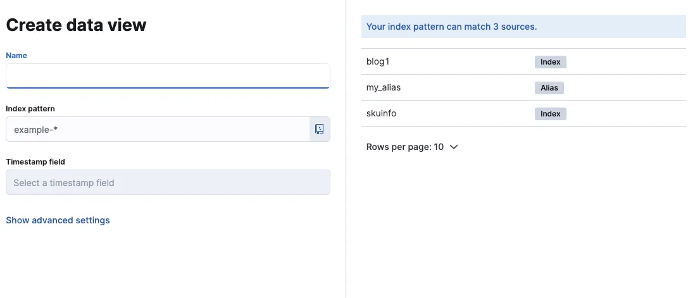
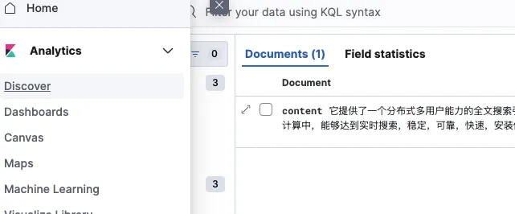
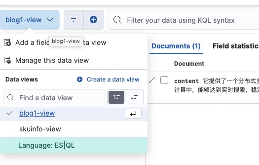

# 1. ElasticSearch简介

ElasticSearch（简称ES）是一个开源的分布式搜索引擎，基于强大的搜索和分析能力，它不仅支持全文检索、精确查询和复杂的数据聚合分析，还具备高可用的分布式架构。作为一个成熟的企业级解决方案，ES在日志分析、电商搜索等场景中被广泛应用，能够帮助企业高效处理和分析大规模数据。

## 1.1 ES vs Solr

1. **性能特点**
   - ES：适合实时搜索，数据更新快
   - Solr：适合数据相对稳定的场景

2. **使用体验**
   - ES：RESTful API，JSON交互，易上手
   - Solr：配置较复杂，学习成本高

# 2. ElasticSearch核心概念

## 2.1 基本概念对照

| 关系型数据库   | ElasticSearch | 说明 | 示例 |
| -------- | ------------- | -- | -- |
| Database | Index         | 索引 | 商品库对应商品索引 |
| Row      | Document      | 文档 | 一条商品记录对应一个商品文档 |
| Column   | Field         | 字段 | 商品名称、价格等属性 |

ElasticSearch是面向文档的搜索引擎，可以存储和索引整个对象或文档。每个索引直接对应关系型数据库中的一个表。

> 版本说明：自ElasticSearch 7.x起Type概念开始废弃，8.x版本已完全移除。当前文档基于ES 8.14.2版本，采用'索引直接对应表'的表述方式。

## 2.2 核心概念

### 2.2.1 索引（Index）

类似数据库中的"表"，是文档的逻辑集合。

关键特性：
- 必须明确映射（Mapping） （即数据结构定义）。
- 支持动态映射（自动推断字段类型）。
- 按时间滚动（如logs-2023-10-01）支持时序数据。
- 支持索引别名（Index Alias）用于无缝切换。

索引命名最佳实践：
- 必须全部小写
- 建议使用有意义的前缀，如：product_、user_等
- 时序数据建议包含日期，如：logs-YYYY-MM-DD
- 避免使用特殊字符，推荐使用下划线分隔

### 2.2.2 索引别名（Index Alias）

索引别名是指向一个或多个索引的虚拟名称，支持：
- 零停机索引切换
- 按时间滚动的索引管理
- 跨索引搜索

创建别名示例：
```json
PUT /logs-2023/_alias/logs_current
```

### 2.2.3 字段（Field）

字段是文档中的数据属性，相当于关系型数据库中的字段。

### 2.2.4 映射（Mapping）

映射定义了数据处理规则，包括：

- 字段的数据类型
- 默认值
- 分析器
- 是否被索引
- 其他数据处理规则

### 2.2.5 文档（Document）

一个文档是一个可被索引的基础信息单元。比如，你可以拥有某一个客户的文档，某一个产品的一个文档，当然，也可以拥有某个订单的一个文档。文档以JSON（Javascript Object Notation）格式来表示，而JSON是一个到处存在的互联网数据交互格式。

每个文档都属于一个索引，并且在该索引中具有唯一的标识符（_id）。文档是不可变的，每次更新实际上是创建一个新版本。

在一个index中，你可以存储任意多的文档。注意，在ES 8.x版本中Type概念已完全移除，每个索引直接对应一种文档类型。

### 2.2.6 近实时性（NRT）
文档写入后，默认 1 秒（refresh_interval）后可被搜索。
通过内存缓冲区（In-memory buffer）和分段（Segment）机制实现。

### 2.2.7 集群（Cluster）

集群是一个或多个节点的集合，它们共同持有数据并提供索引和搜索功能。集群通过唯一名称标识，默认为"elasticsearch"。

### 2.2.8 节点（Node）

节点是集群中的单个服务器，负责数据存储和参与集群的索引、搜索功能。每个节点都有唯一的名字。

节点类型：
1. 主节点（Master Node）
   - 负责集群管理和配置
   - 处理节点的添加和移除
   - 索引的创建和删除

2. 数据节点（Data Node）
   - 存储数据和执行数据相关操作
   - 执行CRUD、搜索和聚合

3. 协调节点（Coordinating Node）
   - 负责路由搜索和索引请求
   - 合并各数据节点的结果

4. 摄入节点（Ingest Node）
   - 在索引前对文档进行预处理
   - 执行管道处理

```ascii
+------------------+
|     Cluster      |
|   +---------+    |
|   | Master  |    |
|   | Node    |    |
|   +----+----+    |
|        |         |
| +------+------+  |
| |             |  |
| v             v  |
+------+    +------+
| Data |    | Data |
| Node |    | Node |
+------+    +------+
```

这个ASCII图展示了一个简单的ElasticSearch集群架构，包含一个主节点和两个数据节点。


### 2.2.9 分片和副本（Shards & Replicas）

**分片**的主要作用：

- 水平分割/扩展内容容量
- 分布式并行操作，提高性能

**副本**的重要性：

- 提供高可用性
- 提升搜索性能（并行搜索）

默认配置：

- 每个索引1个主分片（Elasticsearch 7.0+默认）
- 每个主分片1个副本
- 双节点集群共有10个分片（5主 + 5副本）

# 3. 使用Docker安装ElasticSearch 8.14.2 (非安全)

注意：以下安装说明仅适用于开发环境。在生产环境中，需要启用SSL加密并配置适当的安全策略。

## 3.1 环境准备

1. 设置环境变量
   ```bash
   # vim ~/.bash_profile 将下面两个变量添加到系统环境变量中
   export ELASTIC_PASSWORD="123456"  # elastic用户密码
   export KIBANA_PASSWORD="123456"   # Kibana系统用户密码
   ```
   然后运行 `source ~/.bash_profile` 使配置生效

2. 创建Docker网络
   ```bash
   docker network create es-net
   ```

## 3.2 运行ElasticSearch

```bash
docker run -d --name es-dev \
  -p 127.0.0.1:9200:9200 \
  --network es-net \
  -v es-data:/usr/share/elasticsearch/data \
  -e ELASTIC_PASSWORD=$ELASTIC_PASSWORD \
  -e "discovery.type=single-node" \
  -e "xpack.security.http.ssl.enabled=false" \
  -e "xpack.license.self_generated.type=basic" \
  elasticsearch:8.14.2
```

## 3.3 运行Kibana（可选）

1. 设置kibana_system用户密码
   ```bash
   curl -u elastic:$ELASTIC_PASSWORD -X POST \
     http://localhost:9200/_security/user/kibana_system/_password \
     -H 'Content-Type: application/json' \
     -d '{"password":"'$KIBANA_PASSWORD'"}'
   ```

2. 启动Kibana容器
   ```bash
   docker run -d --name kibana-dev \
     -p 127.0.0.1:5601:5601 \
     --network es-net \
     -e ELASTICSEARCH_HOSTS=http://es-dev:9200 \
     -e ELASTICSEARCH_USERNAME=kibana_system \
     -e ELASTICSEARCH_PASSWORD=$KIBANA_PASSWORD \
     -e "xpack.security.enabled=false" \
     kibana:8.14.2
   ```

## 3.4 许可证配置

1. 检查许可证状态
   ```bash
   curl -u elastic:$ELASTIC_PASSWORD -X GET "http://localhost:9200/_license"
   ```

2. 激活基础许可证
   ```bash
   curl -u elastic:$ELASTIC_PASSWORD -X POST "http://localhost:9200/_license/start_basic?acknowledge=true"
   ```

## 3.5 安装IK分词器

1. 进入容器
   ```bash
   docker exec -it es-dev bash
   ```

2. 安装分词器

```
./bin/elasticsearch-plugin install https://get.infini.cloud/elasticsearch/analysis-ik/8.14.2
```

3. 重启容器

```
docker restart es-dev
```

## 3.6 验证安装

1. 使用curl验证

```
curl -u elastic:$ELASTIC_PASSWORD -X GET "http://localhost:9200/_analyze" -H 'Content-Type: application/json' -d '
{
  "analyzer": "ik_max_word",
  "text": "中国足球真是太烂了"
}'
```

2. 使用Kibana Dev Tools验证

```
GET /_analyze
{
  "analyzer": "ik_max_word",
  "text": "中国足球真是太烂了"
}
```

注意：9300端口用于节点间通信，9200端口用于HTTP API访问。

# 4. 生产环境安装 Elasticsearch（启用ssl）

这部分可以参考官网的文档

<https://elastic.ac.cn/guide/en/elasticsearch/reference/8.17/docker.html#docker-cli-run-dev-mode>

主要是需要生成SSL证书

#### 1. 将ca.crt SSL证书从容器复制到本地机器。

`docker cp ibuy-service-es01:/usr/share/elasticsearch/config/certs/ca/ca.crt .`

#### 2. 请求一个REST API，确保更够通过ca访问elastic

`curl --cacert ca.crt -u elastic:[ELASTIC_PASSWORD] https://localhost:9200`

**这里的** **[ELASTIC_PASSWORD]要替换成你自己.env文件中设置的密码**

如果一切正常，你会看到如下内容:

```
{
  "name" : "es01",
  "cluster_name" : "docker-cluster",
  "cluster_uuid" : "t5DlPYalRAm_tceqPUo7gw",
  "version" : {
    "number" : "8.14.2",
    "build_flavor" : "default",
    "build_type" : "docker",
    "build_hash" : "2afe7caceec8a26ff53817e5ed88235e90592a1b",
    "build_date" : "2024-07-01T22:06:58.515911606Z",
    "build_snapshot" : false,
    "lucene_version" : "9.10.0",
    "minimum_wire_compatibility_version" : "7.17.0",
    "minimum_index_compatibility_version" : "7.0.0"
  },
  "tagline" : "You Know, for Search"
}
```

# 5. 基于Kibana掌握DSL语句

Kibana 是一款开源的数据分析和可视化平台，它是 Elastic Stack 成员之一，设计用于和 Elasticsearch 协作。您可以使用 Kibana 对 Elasticsearch 索引中的数据进行搜索、查看、交互操作。您可以很方便的利用图表、表格及地图对数据进行多元化的分析和呈现。

Kibana 可以使大数据通俗易懂。它很简单，基于浏览器的界面便于您快速创建和分享动态数据仪表板来追踪 Elasticsearch 的实时数据变化。

这一章主要是通过Kibana来熟悉ElasticSearch相关的DSL语句，只简单介绍了一下Kibana，并不深入。我们也可以通过`curl`命令或者 `postman`来访问ElasticSearch

## 5.1 DSL语句使用

在登录了Kibana后，点开左上角菜单栏，点击 **Management** 下的 **Dev Tools**, 然后即可进行下面的练习。

### 5.1.1 Query DSL结构化查询介绍

Query DSL是一个Java开源框架用于构建类型安全的SQL查询语句。采用API代替传统的拼接字符串来构造查询语句。

目前Querydsl支持的平台包括：

-   JPA
-   JDO
-   SQL
-   Java Collections
-   RDF
-   Lucene
-   Hibernate Search

Elasticsearch提供了一整套基于JSON的查询DSL语言来定义查询。Query DSL当作是一系列的抽象的查询表达式树(AST)特定查询能够包含其它的查询，(如 bool ), 有些查询能够包含过滤器(如 constant_score), 还有的可以同时包含查询和过滤器 (如 filtered). 都能够从ES支持查询集合里面选择任意一个查询或者是从过滤器集合里面挑选出任意一个过滤器, 这样的话，我们就可以构造出任意复杂（maybe 非常有趣）的查询了。

### 5.1.2 基础使用

#### 5.1.2.1 基本索引操作

1.  **查询所有索引**

```
GET /_cat/indices?v
```

2.  **删除某个索引**

```
DELETE /user
```

3.  **新增索引**

```
PUT /user
```

4.  **创建映射**

```
PUT /user/_mapping
{
  "properties": {
    "name":{
      "type": "text",
      "analyzer": "ik_smart",
      "search_analyzer": "ik_smart",
      "store": false
    },
    "city":{
      "type": "text",
      "analyzer": "ik_smart",
      "search_analyzer": "ik_smart",
      "store": false
    },
    "age":{
      "type": "long",
      "store": false
    },
    "description":{
      "type": "text",
      "analyzer": "ik_smart",
      "search_analyzer": "ik_smart",
      "store": false
    }
  }
}
```

#### 5.1.2.2 文档操作

##### 5.1.2.2.1 新增文档

```
# 手动指定id用put方法
PUT /user/_doc/1
{
  "name":"李四",
  "age":22,
  "city":"深圳",
  "description":"李四来自湖北武汉！"
}

# 自生成id用POST
POST /user/_doc
{
  "name":"李四",
  "age":22,
  "city":"深圳",
  "description":"李四来自湖北武汉！"
}

#新增文档数据 id=2
PUT /user/_doc/2
{
  "name":"王五",
  "age":35,
  "city":"深圳",
  "description":"王五家住在深圳！"
}

#新增文档数据 id=3
PUT /user/_doc/3
{
  "name":"张三",
  "age":19,
  "city":"深圳",
  "description":"在深圳打工，来自湖北武汉"
}

#新增文档数据 id=4
PUT /user/_doc/4
{
  "name":"张三丰",
  "age":66,
  "city":"武汉",
  "description":"在武汉读书，家在武汉！"
}

#新增文档数据 id=5
PUT /user/_doc/5
{
  "name":"赵子龙",
  "age":77,
  "city":"广州",
  "description":"赵子龙来自深圳宝安，但是在广州工作！",
  "address":"广东省茂名市"
}

#新增文档数据 id=6
PUT /user/_doc/6
{
  "name":"赵毅",
  "age":55,
  "city":"广州",
  "description":"赵毅来自广州白云区，从事电子商务8年！"
}

#新增文档数据 id=7
PUT /user/_doc/7
{
  "name":"赵哈哈",
  "age":57,
  "city":"武汉",
  "description":"武汉赵哈哈，在深圳打工已有半年了，月薪7500！"
}
```

##### 5.1.2.2.2 修改文档

###### 5.1.2.2.2.1 替换操作

使用GET命令查看：

```
#查询user索引下所有的文档
GET /user/_search
{
  "query": {
    "match_all": {}
  }
}
```

更新数据可以使用之前的增加操作,这种操作会将整个数据替换掉，代码如下：

```
#替换id=4的数据
PUT /user/_doc/4
{
  "name":"张三丰",
  "description":"在武汉读书，家在武汉！在深圳工作！"
}
```

然后再查询数据

```
#查询id为4的数据
GET /user/_search
{
  "query": {
    "term": {
      "_id": "4"
    }
  }
}
```

###### 5.1.2.2.2.2 更新操作

我们先使用下面命令恢复数据：

```
#恢复文档数据 id=4
PUT /user/_doc/4
{
  "name":"张三丰",
  "age":66,
  "city":"武汉",
  "description":"在武汉读书，家在武汉！"
}
```

使用POST更新某个列的数据

```
#使用POST更新某个域的数据
POST /user/_update/4
{
  "doc":{
    "name":"张三丰",
    "description":"在武汉读书，家在武汉！在深圳工作！"
  }
}
```

在使用GET命令验证一下：

```
#根据ID查询
GET /user/_search
{
  "query": {
    "term": {
      "_id": "4"
    }
  }
}
```

##### 5.1.2.2.3 删除文档

```
#删除数据
DELETE user/_doc/7
```

### 5.1.3 数据查询

#### 5.1.3.1 查询所有数据

```
#查询所有
GET /user/_search
{
  "query": {
    "match_all": {}
  }
}
```

#### 5.1.3.2 根据ID查询

```
#根据ID查询
GET /user/_search
{
  "query": {
    "term": {
      "_id": "4"
    }
  }
}
```

#### 5.1.3.3 排序查询

```
#搜索排序
GET /user/_search
{
  "query":{
    "match_all": {}
  },
  "sort":{
    "age":{
      "order":"desc"
    }
  }
}
```

#### 5.1.3.4 分页查询

```
#分页实现
GET /user/_search
{
  "query":{
    "match_all": {}
  },
  "sort":{
    "age":{
      "order":"desc"
    }
  },
  "from": 0,
  "size": 2
}
```

解释：  
from:从下N的记录开始查询  
size:每页显示条数

### 5.1.4 过滤查询

#### 5.1.4.1 简单term过滤

term主要用于分词精确匹配，如字符串、数值、日期等  
会计算相关性评分  
以下情况不适用：  
1.列中除英文字符外有其它值  
2.字符串值中有冒号或中文  
3.系统自带属性如_version

如下案例：

```
#过滤查询-term
GET /user/_search
{
  "query": {
      "term": {
        "city": "深圳"
      }
  }
}
```

#### 5.1.4.2 简单terms过滤

terms 跟 term 有点类似，但 terms 允许指定多个匹配条件。 如果某个字段指定了多个值，那么文档需要一起去做匹配 。

案例如下：

```
#过滤查询-terms 允许多个Term
GET /user/_search
{
  "query":{
    "terms":{
      "city":
        [
          "武汉",
          "广州"
        ]
    }
  }
}
```

#### 5.1.4.3 range过滤

range过滤允许我们按照指定范围查找一批数据。例如我们查询年龄范围

案例如下：

```
#过滤-range 范围过滤
#gt表示> gte表示=>
#lt表示< lte表示<=
GET /user/_search
{
  "query":{
    "range": {
      "age": {
        "gte": 30,
        "lte": 57
      }
    }
  }
}
```

#### 5.1.4.4 exists过滤

exists 过滤可以用于查找拥有某个域的数据

案例如下：

```
#过滤搜索 exists：是指包含某个域的数据检索
GET /user/_search
{
  "query": {
    "exists":{
      "field":"address"
    }
  }
}
```

#### 5.1.4.5 match_all查询

可以查询到所有文档，是没有查询条件下的默认语句。

案例如下：

```
#查询所有 match_all
GET /user/_search
{
  "query": {
    "match_all": {}
  }
}
```

#### 5.1.4.6 match查询

match查询是一个标准查询，不管你需要全文本查询还是精确查询基本上都要用到它。

如果你使用 match 查询一个全文本字段，它会在真正查询之前用分析器先分析match一下查询字符：

案例如下：

```
#字符串匹配
GET /user/_search
{
  "query": {
    "match": {
      "description": "武汉"
    }
  }
}
```

#### 5.1.4.7 prefix查询

以什么字符开头的，可以更简单地用 prefix ,例如查询所有以张开始的用户描述

案例如下：

```
#前缀匹配 prefix
GET /user/_search
{
  "query": {
    "prefix": {
      "name": {
        "value": "赵"
      }
    }
  }
}
```

#### 5.1.4.8 multi_match查询

multi_match查询允许你做match查询的基础上同时搜索多个字段，在多个字段中同时查一个

案例如下：

```
#多个域匹配搜索
GET /user/_search
{
  "query": {
    "multi_match": {
      "query": "深圳",
      "fields": [
        "city",
        "description"
      ]
    }
  }
}
```

#### 5.1.4.9 bool过滤

bool 过滤可以用来合并多个过滤条件查询结果的布尔逻辑，它包含一下操作符：

-   must : 多个查询条件的完全匹配,相当于 and。
-   must_not : 多个查询条件的相反匹配，相当于 not。
-   should : 至少有一个查询条件匹配, 相当于 or。
-   filter 子句也要求查询条件 必须 匹配，但与 must 不同，filter 不会影响文档的相关性评分。它仅仅是一个过滤器，用于限制符合条件的文档，而不会对文档进行评分计算

这些参数可以分别继承一个过滤条件或者一个过滤条件的数组：

案例如下：

```
#过滤搜索 bool 
#must : 多个查询条件的完全匹配,相当于 and。
#must_not : 多个查询条件的相反匹配，相当于 not。
#should : 至少有一个查询条件匹配, 相当于 or。
GET /user/_search
{
  "query": {
    "bool": {
      "must": [
        {
          "term": {
            "city": {
              "value": "深圳"
            }
          }
        },
        {
          "range":{
            "age":{
              "gte":20,
              "lte":99
            }
          }
        }
      ]
    }
  }
}
```

#### 5.1.4.10 bool.filter过滤

-   作用：filter 子句也要求查询条件 必须 匹配，但与 must 不同，filter 不会影响文档的相关性评分。它仅仅是一个过滤器，用于限制符合条件的文档，而不会对文档进行评分计算。
-   打分（评分）：filter 不参与相关性评分的计算，因此它比 must 更快，适合用来过滤大量数据，而不需要进行复杂的打分计算。
-   适用场景：在你只需要过滤出符合某些条件的文档，而不关心它们的相关性评分时使用

在这个例子中，文档必须有 city 为 "深圳"，并且 price 在 100 到 200 之间。由于使用了 filter，查询不会对文档进行打分计算，而是直接返回匹配的文档。

```
GET /user/_search
{
  "query": {
    "bool": {
      "filter": [
        {
          "term": {
            "city": {
              "value": "深圳"
            }
          }
        },
        {
          "range":{
            "age":{
              "gte":20,
              "lte":99
            }
          }
        }
      ]
    }
  }
}
```

## 5.2 配置Data View (可选)

后续当我们需要通过Kibana进行可视化分析时（如监控商品访问量、分析用户搜索热词），才需配置Data View。

### 5.2.1 左侧菜单选择Management


### 5.2.2 选择Kibana -> Data Views


### 5.2.3 创建data view

点击右上角 `Create data view`按钮创建



**比如我要创建一个索引** `blog1` **的视图**

-   **Name：表示视图名称，可以叫** `blog1-view`
-   **Index pattern: 你需要先创建索引，然后再选择索引。这里我们已经有了blog1的索引就直接填** `blog1*`


### 5.2.4 查看视图

在菜单栏点击Discover后选择我们刚刚创建的视图名就可以看到了






# 6. 商品搜索功能

## 6.1 功能概述
商品搜索服务是一个基于Elasticsearch的高性能搜索解决方案，提供商品的全文检索、过滤、排序和聚合等功能。该服务支持商品数据的自动同步，并提供灵活的搜索接口。

## 6.2 技术栈

### 6.2.1 核心依赖
- `@nestjs/elasticsearch`: Elasticsearch的NestJS集成模块
- `@elastic/elasticsearch`: Elasticsearch官方Node.js客户端
- `@nestjs/schedule`: 用于定时任务的NestJS模块
- `nest-winston`: 用于日志记录的Winston集成

### 6.2.2 相关模块
- `mall-service-goods/sku`: SKU服务模块，提供商品数据源
- `common/utils/Result`: 统一响应结果处理工具

## 6.3 功能实现

### 6.3.1 数据同步机制

#### 6.3.1.1 自动同步
使用`@nestjs/schedule`的`@Cron`装饰器实现每天凌晨2点的自动同步：
```typescript
@Cron('0 0 2 * * *')
async syncSkuData() {
  this.logger.log('info', '开始同步SKU数据到Elasticsearch...');
  try {
    await this.importSku();
    this.logger.log('info', 'SKU数据同步完成');
  } catch (error) {
    this.logger.error('SKU数据同步失败:', error);
  }
}
```

#### 6.3.1.2 分批导入
为了提高数据导入的可靠性和性能，实现了分批处理机制：
```typescript
async importSku(): Promise<void> {
  try {
    // 1. 检查索引是否存在，不存在则创建
    const indexExists = await this.elasticsearchService.indices.exists({
      index: this.ES_INDEX,
    });

    if (!indexExists) {
      await this.createSkuIndex();
    }

    // 2. 获取所有SKU数据
    const result = await this.skuService.findAll();
    const skuInfos = result.data;

    // 3. 分批处理数据
    for (let i = 0; i < skuInfos.length; i += this.BATCH_SIZE) {
      const batch = skuInfos.slice(i, i + this.BATCH_SIZE);
      await this.processBatch(batch, 0);
      this.logger.log(
        'info',
        `已处理 ${i + batch.length}/${skuInfos.length} 条数据`,
      );
    }
  } catch (error) {
    this.logger.error('导入SKU数据失败:', error);
    throw error;
  }
}
```

#### 6.3.1.3 重试机制
实现了带有指数退避的重试机制，最大重试次数为3次：
```typescript
private async processBatch(
  batch: SkuEntity[],
  retryCount: number,
): Promise<void> {
  try {
    const operations = batch.flatMap((skuInfo) => [
      { index: { _index: this.ES_INDEX, _id: skuInfo.id } },
      skuInfo,
    ]);

    const { errors, items } = await this.elasticsearchService.bulk({
      operations,
      refresh: true,
    });

    if (errors) {
      // 收集失败的项
      const failedItems = items
        .filter((item) => item.index?.error)
        .map((item) => ({
          id: item.index?._id,
          error: item.index?.error,
        }));

      if (failedItems.length > 0 && retryCount < this.MAX_RETRIES) {
        const failedSkus = batch.filter((sku) =>
          failedItems.some((item) => item.id === sku.id.toString()),
        );
        await this.processBatch(failedSkus, retryCount + 1);
      }
    }
  } catch (error) {
    if (retryCount < this.MAX_RETRIES) {
      await new Promise((resolve) =>
        setTimeout(resolve, 1000 * (retryCount + 1)),
      );
      await this.processBatch(batch, retryCount + 1);
    } else {
      throw error;
    }
  }
}
```

### 6.3.2 索引结构
```typescript
mappings: {
  properties: {
    name: { type: 'text', analyzer: 'ik_max_word' },
    price: { type: 'double' },
    categoryName: { type: 'keyword' },
    brandName: { type: 'keyword' },
    spec: { type: 'keyword' }
  }
}
```

### 6.3.3 搜索功能

#### 6.3.3.1 关键词搜索
```typescript
// 关键字查询
if (keywords) {
  boolQuery.bool.must.push({
    match: {
      name: keywords,
    },
  });
}
```

#### 6.3.3.2 过滤条件
支持多种过滤条件：
- 分类过滤
```typescript
if (searchMap[this.SEARCH_CATEGORY]) {
  boolQuery.bool.filter.push({
    term: {
      [`${this.SEARCH_CATEGORY}.keyword`]: searchMap[this.SEARCH_CATEGORY],
    },
  });
}
```

- 品牌过滤
```typescript
if (searchMap[this.SEARCH_BRAND]) {
  boolQuery.bool.filter.push({
    term: {
      [`${this.SEARCH_BRAND}.keyword`]: searchMap[this.SEARCH_BRAND],
    },
  });
}
```

- 规格过滤
```typescript
Object.keys(searchMap).forEach((key) => {
  if (key.startsWith('spec_')) {
    if (typeof searchMap[key] === 'string') {
      boolQuery.bool.filter.push({
        term: {
          [`spec.${key.substring(5)}.keyword`]: searchMap[key],
        },
      });
    } else if (Array.isArray(searchMap[key])) {
      boolQuery.bool.filter.push({
        terms: {
          [`spec.${key.substring(5)}.keyword`]: searchMap[key],
        },
      });
    }
  }
});
```

- 价格区间过滤
```typescript
const price = searchMap[this.SEARCH_PRICE];
if (price) {
  const [minPrice, maxPrice] = price.split('-');
  if (maxPrice !== '*') {
    boolQuery.bool.filter.push({
      range: {
        price: { gte: minPrice, lte: maxPrice },
      },
    });
  } else {
    boolQuery.bool.filter.push({
      range: {
        price: { gte: minPrice },
      },
    });
  }
}
```

#### 6.3.3.3 排序
支持自定义字段排序：
```typescript
const sortField = searchMap['sortField'];
const sortRule = searchMap['sortRule'];
if (sortField && sortRule) {
  searchRequest.sort.push({
    [sortField]: {
      order: sortRule.toLowerCase() === 'desc' ? 'desc' : 'asc',
    },
  });
}
```

#### 6.3.3.4 聚合
支持分类、品牌和规格的聚合统计：
```typescript
searchRequest.aggregations = {
  // 分类聚合
  [this.ES_CATEGORY_AGR]: {
    terms: { field: `${this.SEARCH_CATEGORY}.keyword`, size: 50 },
  },
  // 品牌聚合
  [this.ES_BRAND_AGR]: {
    terms: { field: `${this.SEARCH_BRAND}.keyword`, size: 50 },
  },
  // 商品规格聚合
  [this.ES_SPEC_MAP_AGR]: {
    terms: { field: 'spec.keyword', size: 10000 },
  },
};
```


## 6.4 完整代码实现

完整的搜索服务实现请参考 该[仓库](https://github.com/SaebaRyoo/ibuy-admin-backend) 的[search.service.ts](https://github.com/SaebaRyoo/ibuy-portal-backend/blob/main/src/mall-service/mall-service-search/search.service.ts) 文件。

> 正常是导入逻辑和搜索逻辑分在不同的项目，这里为了方便演示，将导入逻辑和搜索逻辑放在了同一个项目中。
> 搜索逻辑也可以在[portal](https://github.com/SaebaRyoo/ibuy-portal-backend) 项目中查看


## 6.5 API使用示例

### 6.5.1 基础搜索
```
GET /search/query?keywords=手机
```

### 6.5.2 带过滤的搜索
```
GET /search/query?keywords=手机&categoryName=智能手机&price=1000-2000
```

### 6.5.3 带排序的搜索
```
GET /search/query?keywords=手机&sortField=price&sortRule=desc
```

### 6.5.4 带规格过滤的搜索
```
GET /search/query?keywords=手机&spec_颜色=黑色&spec_内存=8GB
```
