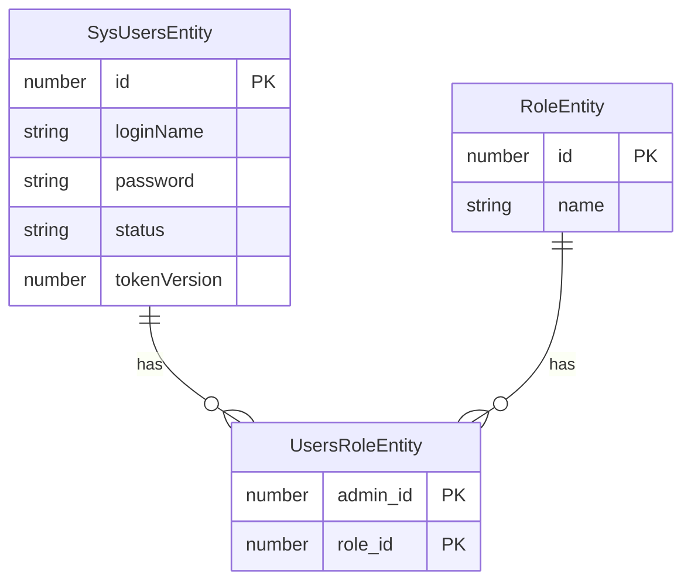

    
## 前言

本系统实现了一个基于RBAC（Role-Based Access Control）的认证授权系统，主要包含以下功能：

- 用户认证：实现用户登录、登出等基础认证功能
- 权限控制：基于RBAC模型的细粒度权限控制
- JWT认证：使用JWT实现无状态的用户身份验证

## 数据库设计

### 实体关系图



### 表结构说明

#### 1. 用户表 (ibuy_admin)

| 字段名 | 类型 | 说明 | 约束 |
|--------|------|------|-------|
| id | number | 用户ID | 主键 |
| login_name | string | 登录名 | 唯一，可空 |
| password | string | 密码 | 可空 |
| status | string | 用户状态 | 可空 |
| tokenVersion | number | token版本号 | 默认值0 |

#### 2. 角色表 (ibuy_role)

| 字段名 | 类型 | 说明 | 约束 |
|--------|------|------|-------|
| id | number | 角色ID | 主键 |
| name | string | 角色名称 | 唯一，可空 |

#### 3. 用户角色关联表 (ibuy_admin_role)

| 字段名 | 类型 | 说明 | 约束 |
|--------|------|------|-------|
| admin_id | number | 用户ID | 联合主键 |
| role_id | number | 角色ID | 联合主键 |

## 系统配置

### 环境变量

需要在.env文件中配置以下环境变量：

```env
JWT_SECRET=your_jwt_secret_key
```
## 核心功能

### 1. 认证流程

#### 1.1 登录认证

用户登录时，系统会：
1. 验证用户名和密码
2. 生成包含用户信息的JWT Token
3. 返回Token和用户信息

```typescript
// auth.controller.ts
@Public()
@HttpCode(HttpStatus.OK)
@Post('login')
async signIn(@Body() user: Record<string, any>) {
  return this.authService.signIn(user.loginName, user.password);
}
```

#### 1.2 JWT认证守卫

系统使用全局AuthGuard进行Token验证：

```typescript
// auth.guard.ts
@Injectable()
export class AuthGuard implements CanActivate {
  async canActivate(context: ExecutionContext): Promise<boolean> {
    // 检查是否是公开接口
    const isPublic = this.reflector.getAllAndOverride<boolean>(IS_PUBLIC_KEY, [
      context.getHandler(),
      context.getClass(),
    ]);
    if (isPublic) return true;

    // 验证Token
    const request = context.switchToHttp().getRequest();
    const token = this.extractTokenFromHeader(request);
    if (!token) {
      throw new UnauthorizedException();
    }

    try {
      const payload = await this.jwtService.verifyAsync(token);
      request.user = payload;
    } catch {
      throw new UnauthorizedException();
    }
    return true;
  }
}
```

### 2. RBAC权限控制

#### 2.1 角色权限守卫

使用PermissionGuard实现基于角色的权限控制：

```typescript
// permission.guard.ts
@Injectable()
export class PermissionGuard implements CanActivate {
  async canActivate(context: ExecutionContext): Promise<boolean> {
    const request = context.switchToHttp().getRequest();
    if (!request.user) return true;

    // 获取用户角色
    const roleIds = await this.usersRoleService.findRolesIdByUserId(request.user.user_id);
    const roles = await this.roleService.findRolesByRoleIds(roleIds.data);
    const roleNames = roles.data?.map((role) => role.name);

    // 检查权限
    const requiredRoles = this.reflector.getAllAndOverride(PERMISSION_KEY, [
      context.getClass(),
      context.getHandler(),
    ]);

    return requiredRoles?.some((role) => roleNames?.includes(role)) ?? true;
  }
}
```

#### 2.2 权限装饰器

提供@Permission装饰器用于声明接口所需的角色权限：

```typescript
// permission.decorator.ts
export const PERMISSION_KEY = 'permission_by_roles';
export const Permission = (...permissions: string[]) =>
  SetMetadata(PERMISSION_KEY, permissions);
```

### 3. 使用示例

#### 3.1 接口权限控制

```typescript
// role.controller.ts
@Permission('admin')  // 声明需要admin角色才能访问
@Controller('role')
export class RoleController {
  @Post()
  createRole(@Body() createRoleDto: CreateRoleDto) {
    return this.roleService.createRole(createRoleDto);
  }
}
```

#### 3.2 全局配置

在AppModule中注册全局守卫：

```typescript
// app.module.ts
@Module({
  providers: [
    {
      provide: APP_GUARD,
      useClass: AuthGuard,
    },
    {
      provide: APP_GUARD,
      useClass: PermissionGuard,
    },
  ],
})
export class AppModule {}
```


## 注意事项

1. 所有需要认证的接口都会自动经过AuthGuard验证
2. 使用@Public()装饰器可以将接口标记为公开接口
3. 使用@Permission()装饰器可以指定访问接口所需的角色
4. 角色验证基于RBAC模型，支持多角色
